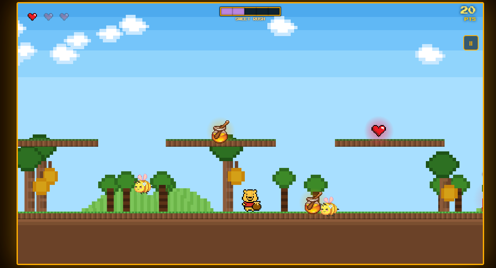

# 🍯 Pooh's Honey Run

> A vibrant retro 2D pixel platformer built with pure HTML5 Canvas and the Web Audio API. Zero dependencies.

🎮 **[Play Live Demo](https://pooh-honey-run.vercel.app/) 



---

## 📖 About the Game

Guide Winnie the Pooh and unlockable heroes (Goku, Powerpuff Girls, Capybara, Batman) through the Hundred Acre Wood and the dangerous Forest Inferno! 

* 🍯 **Collect Honey Pots** to boost your score and trigger **Sweet Rush** (golden invincibility & speed).
* 🍄 **Find the Mega Mushroom** to unleash **Mega Mode** and smash through obstacles.
* 🔦 **Brave the Dark Fog** to locate the secret key, talk to the wizard, and claim the **Golden Easter Egg**.
* ⚔️ **Defeat Bosses** including the giant Boss Bee and the balloon-throwing Joker!

---

## 🎮 Controls

| Action | Keyboard | Touch / Mobile |
| :--- | :--- | :--- |
| **Move** | `A` / `D` or `◄` / `►` | Hold left / right side of screen |
| **Jump** | `W` / `Space` / `▲` *(hold for higher jump)* | Tap upper half of screen |
| **Drop Down** | `S` / `▼` *(through platforms)* | Tap bottom center of screen |
| **Mega Mode** | `R` *(requires Mega Mushroom)* | Tap when mushroom is ready |
| **Open Door** | `K` or Mouse Click *(requires Key)* | Tap on the door |
| **Claim Egg** | Hold `P` for 2 seconds *(near egg)* | — |
| **Pause** | `P` or Pause Button | Tap ⏸ button |

---

## 🚀 How to Run Locally

No installations, bundlers, or `node_modules` required!

1. Download or clone this repository:
   ```bash
   git clone https://github.com/YOUR-GITHUB-USERNAME/YOUR-REPO-NAME.git
   ```
2. Double-click **`index.html`** to play in any web browser.


---

## 🛠️ Built With

* **HTML5 Canvas** — 60 FPS pixel-art rendering ($1100\times 620$).
* **Vanilla JavaScript (ES6+)** — Deterministic physics & component-based architecture.
* **Web Audio API** — Procedural chiptune music & sound synthesizer.
* **CSS3** — Responsive layout and retro arcade modals.

---

## 📄 Documentation

For deep technical details, physics constants, entity dimensions, and architecture for AI or developers, see [`pooh_honey_run.md`](pooh_honey_run.md).
